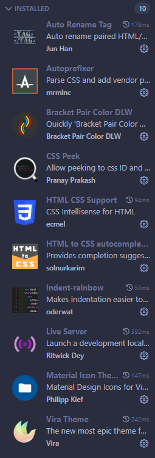
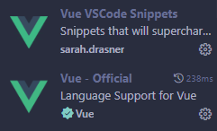

# Vuetiful

## 개발환경 구성하기

### - vscode 설치



### - nodejs 설치

     ```
        명령어에서
        brew install -g n
        sudo n 20
        node -v # 노드 설치버전확인 가능.
        sudo n 16
        sudo n # 원하는 노드버전으로 변경 가능
        softwareupdate --install-rosetta # 에러 발생시 진행
     ```

### - git 설치

- 생략

### - vue cli 설치

- vue 개발에 필요한 유용한 다양한 여러가지 도구들을 제공하는 cli

```
   npm install -g @vue/
   vue --version  # vue 버전확인
```

### - vue js 프로젝트만드는법

- CDN
  - html에 스크립트 태그를 삽입
  ```
   <script src="https://unpkg.com/vue@3/dist/vue.global.js"></script>
  ```
- NPM (강추)
  ```
   $ npm init vue@latest # scaffolding(뼈대 잡아주는)명령어
   $ npm install # package.json을 읽어서 필요한 패키지를 설치. node_modules 생성
  ```
- VUE CLI (almost deprecated)

  ```
  $ vue create .

  ```
